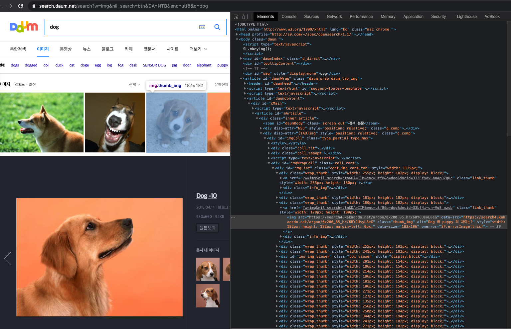

# Web image crawler

## WebDriver를 이용한 이미지 크롤링

- WebDriver is an open source tool for automated testing of webapps across many browsers. It provides capabilities for navigating to web pages, user input, JavaScript execution, and more.  ChromeDriver is a standalone server that implements the [W3C WebDriver standard](https://w3c.github.io/webdriver/webdriver-spec.html). ChromeDriver is available for Chrome on Android and Chrome on Desktop (Mac, Linux, Windows and ChromeOS). 

- Web Driver : 웹드라이버는 웹 앱을 자동으로 테스팅하기 위해 만들어진 open source tool 

  

## Chrome Driver

- Chrome Driver : W3C [WebDriver](https://www.w3.org/TR/webdriver/) Standard를 구현하는 독립형 서버
- 크롬 드라이버는 크롬 버전, OS에 따라 상이하므로 확인 후 다운로드 
- https://chromedriver.storage.googleapis.com/index.html?path=90.0.4430.24/

## Requirements 

- Python3
- pip install dload
- pip install beautifulsoup4

## 사용법 

```shell
$python3 main.py --counter 5
```




#### 함께보면 좋은 링크

- [Beautiful Soup으로 정보 가져오기(get_img함수에서 어떻게 BeautifulSoup를 사용했는지 도움을 주는 블로그)](https://m.blog.naver.com/kiddwannabe/221177292446)


